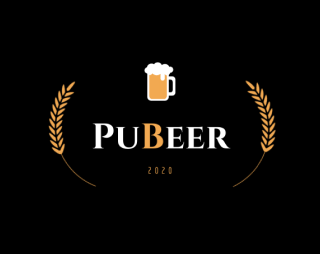

<h1 align="center">
  
  <br/>
</h1>
</br>

## 💻 Projeto
O Pubeer é um aplicativo desenvolvido com o intuito de reunir pessoas e simular um bar de modo online.
Ao abrir o aplicativo, o usuário tem opções de:
    - Entrar em uma mesa para socialização;
    - Jogar um quiz que vale ranking;
    - Solicitar sua bebida no Ze delivey pelo Pubeer;

Seu lema é, "Reiventando o conceito do bar...".
<br />
<p align="center">
</p>

## 🚀 Tecnologias

Esse projeto foi desenvolvido com as seguintes tecnologias:

- [TypeScript](https://www.typescriptlang.org/)
- [React Native](https://facebook.github.io/react-native/)
- [Expo](https://expo.io/)
- [Dialogflow API](https://cloud.google.com/dialogflow/docs/reference/rest/v2-overview)
- [Styled Components](https://styled-components.com/)
</br>

## :hammer: Ferramentas
- [Visual Studio Code](https://code.visualstudio.com)
- [Figma](https://www.figma.com/)
</br>

## 🔥 Instalação

```bash
# Clone este repositório
$ git clone https://github.com/pubeer-ambev/pubeer-mobile.git

# Navegue até a pasta pubeer-mobile e execute os comandos:
$ npm install ou yarn install
$ npm start ou yarn start


